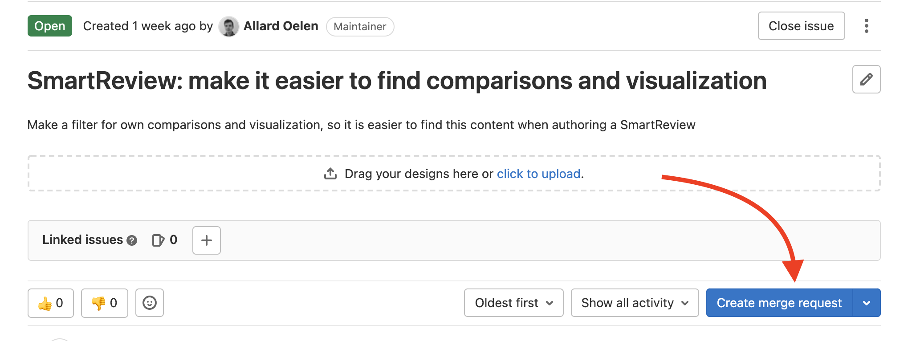
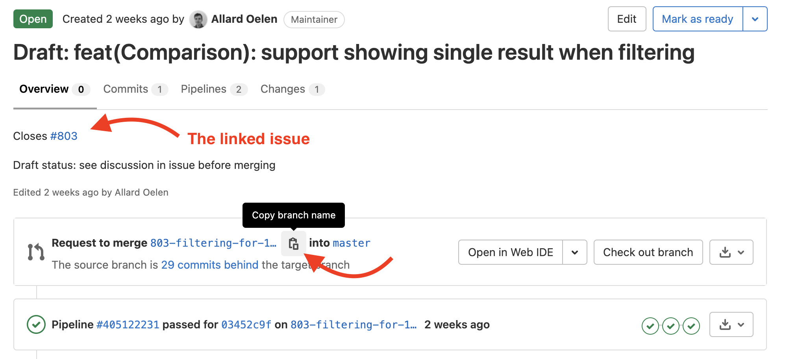
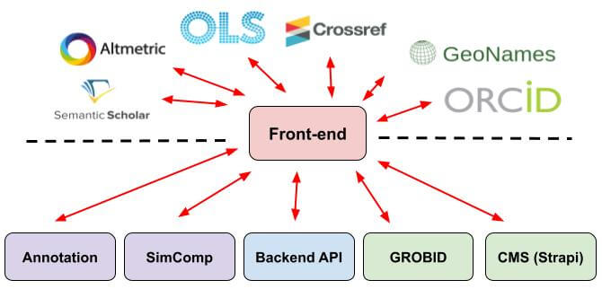

# Contributing

Welcome at the contributing page. Since you are here, probably you are interested to start contributing to the ORKG frontend code base, which is great! 😁

On this page, we briefly describe how you can contribute, and explain some of the steps in detail. We do not necessarily explain best practices on this page, but just how we are doing things within the frontend repo currently. So even if you are an experienced programmer, it makes sense to read this document to ensure understanding of our workflow. In this manual we assume you are using Git via the terminal. But of course, the same actions can be taken if you use a GUI (like [Github Desktop](https://desktop.github.com/)) to manage your Git repo.

## 1. Create an issue

Every change within the frontend repo has a respective issue. No matter how small the contribution is (even changes as small as fixing a typo). By requiring an issue for each code contribution, we make it easier for ourselves. Don't think whether a contribution is 'worth' an issue, just always create one.

So the first step is to either [create a new issue via this page](https://gitlab.com/TIBHannover/orkg/orkg-frontend/-/issues/new?issue), or start from an issue that already exists in the [list of all issues](https://gitlab.com/TIBHannover/orkg/orkg-frontend/-/issues). Once you start working on your issue, ensure you **assign the issue to yourself** in the right sidebar. If you assign an issue to yourself, you are telling others: "Hey, I am working on this issue, please talk to me first if you also want to work on it".

## 2. Create a merge request

Visit the page of the issue that you want to work on. From that page, you can create a merge request. Click on the button `Create merge request` [1]. When clicking this button, a merge request is created that is automatically linked to the issue you are currently visiting. Also a branch is created for you.

[1]

## 3. Checkout the branch locally

After the merge request is created, you can visit it from the [list of all merge requests](https://gitlab.com/TIBHannover/orkg/orkg-frontend/-/merge_requests) or click the linked merge request from the issue page. From this page you can see the issue that is linked [2]. This issue is closed automatically once the merge request is merged.

Now click the `Copy branch name` button to copy the branch name to your clipboard. [2]

[2]

Assuming you already setup the frontend on your local machine. Go to the repo in your terminal, and checkout the just created branch.

First you pull the latest changes:

`git pull`

Then you checkout the branch you just created. Remember, you just copied the name to your clipboard, you can just paste the name. For example:

`git checkout 803-filtering-for-1-paper-in-a-published-comparison`

## 4. Committing your changes

You can work on the code and once you are finished you can commit your code. (In case you are working on multiple issues in the same merge request/branch, we recommend having separate commits for each issue).

Once you are done, you can commit your changes like this:

`git add .`
`git commit -m "Your message here"`.

The message you are specifying is quite important here. We follow the [Conventional Commits format](https://www.conventionalcommits.org/en/v1.0.0/), which specifies how the commit message should look like. Messages look like: `type(Component): the change message`, for example: `feat(Comparison): support sharing links with unauthorized users`.

Finally, push the changes to the remote:

`git push`

## 5. Finalize your merge request

Once you are finished with your merge request, there are a few more steps you have to take within GitLab. First visit your MR page in GitLab and review your changes in the `Changes` tab. If it all looks good, go to the `Overview` page again and edit your merge request.

While editing, make sure you are doing the following:

1. Remove `draft:` from the title, to indicate your merge request is ready.
2. Change the title of the merge request to also follow the [Conventional Commits format](https://www.conventionalcommits.org/en/v1.0.0/). It is important to specify a title that is understandable by all users. The title of the merge request is used to automatically create the [ORKG changelog](https://www.orkg.org/orkg/changelog).
3. Provide a clear description of the merge request. You don't have to explain the issue again (that is already part of the issue), but explain what you did to fix it. More importantly, also explain what is needed for the reviewer to test the merge request. For example, provide steps to the reviewer.
4. Set the `Assignees` field to yourself
5. Set the `Reviewers` field to the person you want to review the merge request. This should be an ORKG team member.
6. Optionally, you can specify other merge requests that need to be merged first by setting the field `Merge request dependencies`. These merge requests can come from any repo (so not necessarily the frontend).
7. Finally, save your changes

## 6. You are done

Nice, you did it! Now, you have to wait a bit until a team member reviews your merge request. Sometimes, we make tiny changes ourselves to the code, mostly related to styling. If bigger changes are needed, or if something is unclear, we use the `Review` feature to add comments to certain lines of code. Then you are asked to update your merge request accordingly. Once merged, your changes are not directly visible in production. You have to wait until a new ORKG frontend version is released.

## What is next?

-   [Consider writing tests for your code](https://gitlab.com/TIBHannover/orkg/orkg-frontend/-/wikis/Contributing:-automated-testing) to increase the code quality and maintainability

# Architecture

To get familiar with the code structure of ORKG, here’s a short summary of how the ORKG front-end code base is organized. This will help you to know where to look and where you should change the code.

Another resource is this video about an introduction to ORKG frontend development: https://www.youtube.com/watch?v=3eec1OJUQ4Y

## Bird's Eye View

On the highest level, ORKG front-end is the interface that uses the ORKG backend API besides other internal and external services to provide tools for users to explore and curate the knowledge graph.

The internal services are maintained in separate repositories, and each one of these services is providing an API for specific features.

-   [Annotation](https://gitlab.com/TIBHannover/orkg/annotation): for abstract annotation feature.
-   [SimComp](https://gitlab.com/TIBHannover/orkg/orkg-similarity): for the similarity and comparison services features and also the persistent storage of objects related to comparison configuration and result, visualizations, url shortener, reviews and literature list.
-   [Backend API](https://gitlab.com/TIBHannover/orkg/orkg-backend): the main backend API.
-   [GROBID](https://gitlab.com/TIBHannover/orkg/annotation/-/blob/master/docker-compose.yml#L12): used to parse pdf, mainly for Survey table extractor.
-   [Strapi](https://gitlab.com/TIBHannover/orkg/strapi): the CMS for the help center and some other content like `Latest news`

## Code Map

This section talks briefly about various important directories and files in the source code.

-   **src/slices** : This directory deals with [react-redux](https://redux.js.org/) using [Redux Toolkit](https://redux-toolkit.js.org/) approach.
-   **src/assets**: for any assets like images, csv or something related to scss and bootstrap customization.
-   **src/components**: small components or reusable components.
-   **src/constants**: any constant values that we are used in the frontend
-   **src/libs**: mostly code related to visualization
-   **src/pages**: we dedicate a separated file for each ORKG page
-   **src/services**: ORKG and external services API wrappers
-   **src/index.js**: entry point of the application
-   **src/network.js**: wrappers for fetch functions of HTTP methods like POST,GET.
-   **widget**: code related to [orkg widget](https://gitlab.com/TIBHannover/orkg/orkg-frontend/-/blob/master/widget/README.md).
